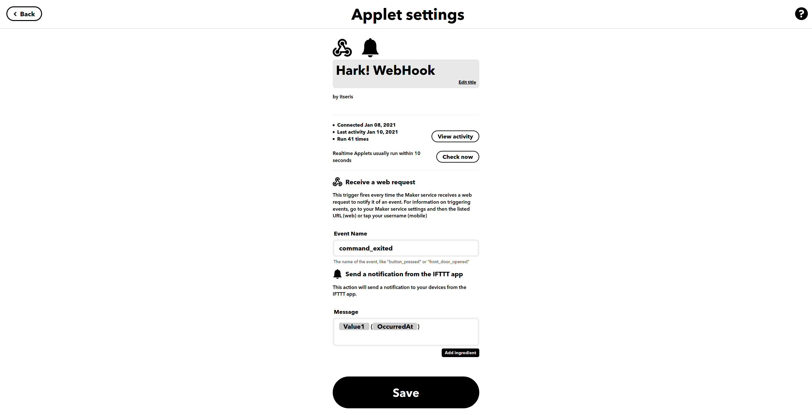

<h1 align="center">Hark!</h1>
<h4 align="center">Announce when your long running command has finished!</h4>

## Features

<table>
    <tr><td><b>100% Rust</b></td></tr>
    <tr><td><b>Powered by <a href="https://ifttt.com/home">IFTTT</a> for recieving notifications on the go</b></td></tr>
    <tr><td><b>Support for most platforms</b></td></tr>
    <tr><td><b>Automatiaclly times commands</b></td></tr>
    <tr><td><b>Can monitor already started processes</b></td></tr>
    <tr><td><b>Get updated on the ETA, status and more! (coming soon)</b></td></tr>
    <tr><td><b>Miniscule overhead</b></td></tr>
</table>


## Usage

```bash
Hark!

USAGE:
    hark [OPTIONS] [CMD]...

FLAGS:
    -h, --help       Prints help information
    -V, --version    Prints version information

OPTIONS:
    -k, --key <APIKEY>     IFTTT API Key
    -c, --config <FILE>    Sets a custom config file [default: /etc/hark.toml]
    -p, --process <PID>    PID of the process to monitor

ARGS:
    <CMD>...    Command and arguments to be run
```

## IFTTT
Before being able to use `hark`, you'll need to setup the IFTTT applet. I've included a screenshot of mine here:

The input should be the `Webhook` service. `hark` specifically uses the `value1` field, so you'll need to include that in your output.
Your output can be whatever you'd like to get your notifications on. I've used the `App Notifications`, but you could use `SMS` or `email`.

## Examples

Use hark to time and launch a command:
```bash
hark rsync -a really/large/dir/ another/dir/
```
Your notification will be something like:
```
"rsync" finished with success after 45.32m (January 8, 20201 at 9:30pm)
```
---
You can use it to attach to an existing process by the processes PID:
```bash
hark -p 2077
```
Your notification will be something like:
```
"rsync" (PID 2077) finished with status "47" after 45.32m (January 8, 20201 at 9:30pm)
```
---
You can use it without any arguments, where `hark` will just send a notification right away:
```bash
dd if=/dev/zero of=/dev/sda1 bs=1M; hark
```
Your notification will be something like:
```
Command finished (January 8, 20201 at 9:30pm)
```


## Config

You can use the configuration file to store your API key, so you don't need to input it everytime you run the command.
Configuration files can be given in any of the following formats: `JSON, YAML, TOML, HJSON`.

An example `.toml` file would look like this:
```toml
apikey = "youriftttapikeyhere"
```

By default `hark` will look for a configuration file at `/etc/hark.toml`.
This file can be changed via the command line options.
If the specified or default configuration file is not found, `hark` will look for a configuration file in the current directory with the name `hark.*` where `*` is any of the supported configuration types.


## Build

First [install](https://www.rust-lang.org/tools/install) Rust (recommended using rustup).

```zsh
$ git clone https://github.com/erismik/hark.git
$ cd hark
$ cargo build --release
```


## Install

Using cargo,

```bash
$ cargo install --path .
```


## Contributions

Suggestions, issues, and pull requests are welcome!
